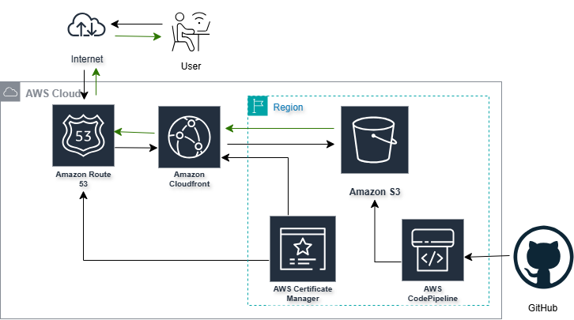

# 🌐 Static Website Hosting on AWS with CICD Integration

---
The architecture follows a globally distributed, secure, and scalable design using key AWS services to deliver and manage static content efficiently.

### 🔧 Components Used

- **Amazon S3** – Hosts your static files (HTML, CSS, JS) with website hosting enabled
- **CloudFront (Global Service)** – Delivers content via edge locations around the world
- **Route 53** – Maps your custom domain to the CloudFront distribution
- **AWS Certificate Manager (ACM)** – Provides HTTPS certificates (must be provisioned in `us-east-1` for CloudFront)
- **AWS CodePipeline** – Automates deployment from GitHub to S3, triggering cache invalidation on CloudFront

### 🖼️ Architecture Diagram

---

## 🚀 Implementation Steps

### 1️⃣ Set Up the S3 Bucket

- Create a new S3 bucket.
- Keep default settings and block all public access.
- Upload Hosts your static files (HTML, CSS, JS) with website hosting enabled.

---

### 2️⃣ Configure Route 53 for Domain Registration

- Register your custom domain using **Amazon Route 53**.
- Validate and ensure your domain is in an `ACTIVE` state.

---

### 3️⃣ Set Up CloudFront

- Create a **CloudFront distribution** and set your S3 bucket as the origin.
- Enable **Origin Access Identity (OAI)** to securely connect CloudFront with S3.
- Modify caching behavior, HTTP methods, and set the desired Price Class.
- Use **ACM** to generate an SSL certificate (refer to Step 4).
- Specify the default root object (e.g., `index.html`).
- Verify that the CloudFront URL correctly serves your site content.

---

### 4️⃣ Create an SSL Certificate with AWS Certificate Manager

- Request a public certificate in **ACM** for your domain and subdomains.
- Use **Route 53 DNS validation** by creating CNAME records as prompted.

---

### 5️⃣ Configure Alternate Domain Names

- Add **alternate domain names (CNAMEs)** in the CloudFront distribution settings.
- Update your **Route 53 DNS records** to route traffic to CloudFront.

---

### 6️⃣ Automate Deployment with AWS CodePipeline

- Create a **custom CodePipeline** that uses GitHub as the source.
- Skip build/staging steps; direct deploy content to the S3 bucket.
- Test that changes in the repository reflect on the live website.
- If updates don’t appear, **invalidate the CloudFront cache** to clear old content.

---

## ✅ Final Output

A fully functional, secure, and scalable static website delivered via AWS services, automatically updated through GitHub integration.

---

Happy hosting! 🎉
