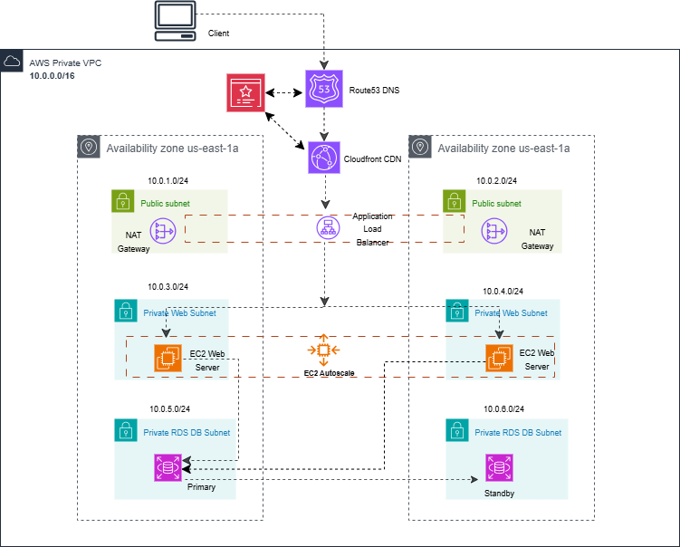

# 🌐 AWS 3-Tier Application Deployment with Terraform

This repository is created to **learn and deploy a 3-tier web application** on AWS Cloud using Terraform.

---

## 📦 Prerequisites

Before deploying, ensure the following components are in place:

- **Amazon S3**  
  Used to store the `.tfstate` file in the remote backend.

- **ACM (AWS Certificate Manager)**  
  Provision a certificate and make sure it's in the `ISSUED` state.

- **Hosted Zone**  
  Configure your DNS provider (e.g., Route 53) with the necessary hosted zone.

- **`terraform.tfvars` File**  
  Create this file at the root level with your specific variable values.

---

## 📁 Folder Structure

/ ├── Modules/         # Reusable Terraform modules  

  └── Main Files       # Entry-point .tf files at the root leve

---
### 🖼️ Architecture Diagram

## 🛠️ AWS Services Breakdown

### 🚦 Network & Content Delivery

- **VPC**
- **Public / Private Subnets**
- **Route Tables**
- **Internet Gateway**
- **NAT Gateway**
- **Elastic IP (EIP)**
- **Security Groups**
- **Route 53** – DNS management
- **CloudFront** – CDN for efficient content delivery

### 🧮 Compute & Scaling

- **EC2 Instances** – Core application servers
- **Elastic Load Balancer**
- **Launch Templates**
- **Auto Scaling Groups**

### 🔐 Security & Compliance

- **AWS Certificate Manager (ACM)**  
  Manages SSL/TLS certificates for secure HTTPS communication.

---

Feel free to fork the repo, raise issues, or suggest improvements. Happy deploying 🚀

                                                     

