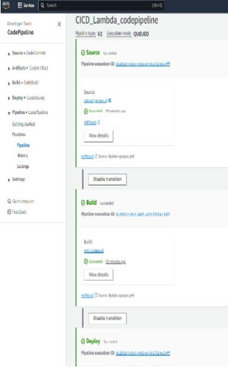

# 🚀 CI/CD Pipeline with AWS Lambda

## 🔐 IAM Roles

### CodeDeploy
- **Required Policies**:
  - `AmazonS3FullAccess`
  - `AWSCodeDeployRoleForLambda`
  - Add necessary Lambda permissions

### CodeBuild
- **Default Service Role Permissions**:
  ```json
  "Action": [
    "lambda:AddPermission",
    "lambda:RemovePermission",
    "lambda:CreateAlias",
    "lambda:UpdateAlias",
    "lambda:DeleteAlias",
    "lambda:GetFunction",
    "lambda:UpdateFunctionCode",
    "lambda:UpdateFunctionConfiguration",
    "lambda:PutFunctionConcurrency",
    "lambda:DeleteFunctionConcurrency",
    "lambda:PublishVersion"
  ]
  
### 🛠️ Setup Steps
- **Create Lambda Function/Application Code**

- **Define an Alias**

- **Set up via AWS Console or automation scripts**

- **Configure CodeBuild Project**

- **Include your buildspec.yml**

- **Attach the appropriate IAM role**

- **Configure CodeDeploy**

- **Set up deployment group and deployment**

- **Use appspec.yml**

- **Attach the IAM role**

- **Final Output**

A fully automated CI/CD pipeline that builds, packages, and deploys your Lambda Function



## Feel free to fork the repo, raise issues, or suggest improvements. Happy deploying 🚀

