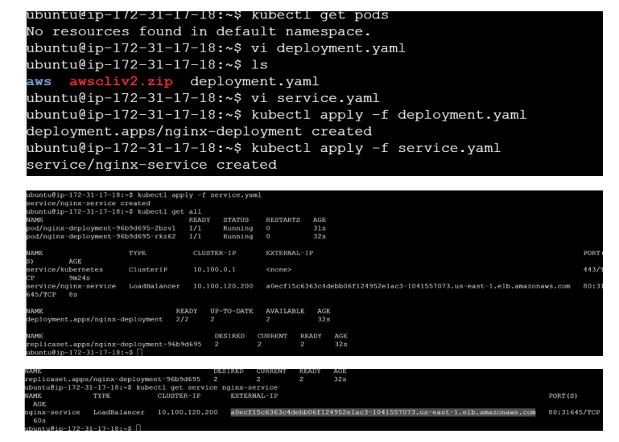
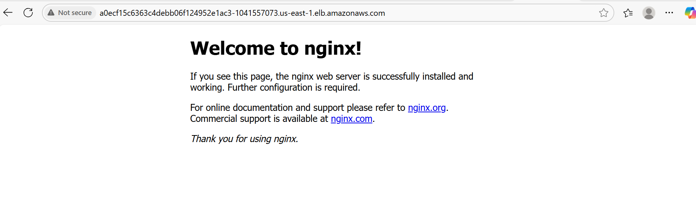
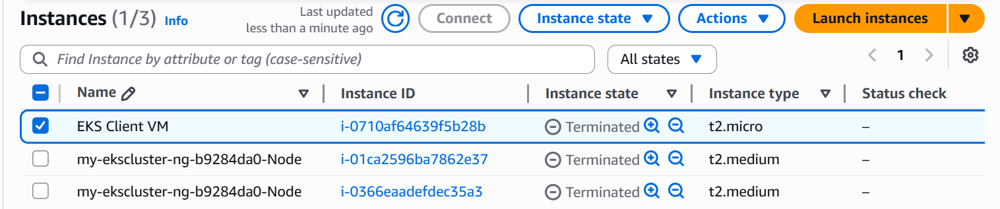

# 🚀 Launch Amazon EKS Using EC2 Ubuntu Client

This guide outlines how to provision an Amazon EKS cluster using eksctl from a lightweight Ubuntu EC2 instance. You'll install required tools, configure IAM permissions, deploy an app, and clean up when done.

# ⚙️ Step-by-Step Instructions
1️⃣ Launch EC2 Ubuntu Instance
- Instance Type: t2.micro (Free Tier eligible)
- AMI: Ubuntu 20.04+
- Use it as your EKS management client.
- Connect via SSH:

2️⃣ Install kubectl

      curl -o kubectl https://amazon-eks.s3.us-west-2.amazonaws.com/1.19.6/2021-01-05/bin/linux/amd64/kubectl
      kubectl version --short --client

3️⃣ Install AWS CLI and eksctl

🔹 AWS CLI

        
        sudo apt update
        sudo apt install unzip
        curl "https://awscli.amazonaws.com/awscli-exe-linux-x86_64.zip" -o "awscliv2.zip"
        unzip awscliv2.zip
        sudo ./aws/install
        aws --version
🔹 eksctl
         
          curl --silent --location "https://github.com/weaveworks/eksctl/releases/latest/download/eksctl_$(uname -    s)_amd64.tar.gz" | tar xz -C /tmp
          sudo mv /tmp/eksctl /usr/local/bin
          eksctl version

4️⃣ Create IAM Role for EC2 Instance
Attach the following AWS managed policies to the role:
- AmazonEKSClusterPolicy
- AmazonEKSWorkerNodePolicy
- AmazonEC2ContainerRegistryReadOnly
- AmazonEKS_CNI_Policy
Assign this role to the EC2 instance from the IAM dashboard or via CLI.

5️⃣ Create Your EKS Cluster
          
           $ eksctl create cluster --name my-ekscluster --region us-east-1 --node-type t2.medium --zones us-east-1a,us-east-1b

🔍 Configure kubectl for Your Cluster

            
            aws eks update-kubeconfig --name my-ekscluster --region us-east-1
            kubectl get nodes

            
# 🚀 Deploy Sample Nginx App

   Deployment.yaml

   Service.yaml

Apply manifests:
      
      kubectl apply -f Deployment.yaml
      kubectl apply -f Service.yaml
      kubectl get svc

#  ✅ Validate - Components_application from EKS

Launched application from EKS

app_launch.png

# 🧹 Cleanup Resources

  
  1️⃣ Delete the EKS Cluster:
       eksctl delete cluster --name my-ekscluster --region us-east-1

  2️⃣ Delete EC2 EKS Client:
  
      - Go to AWS EC2 Console                                           
      - Select your instance → Actions → Terminate

