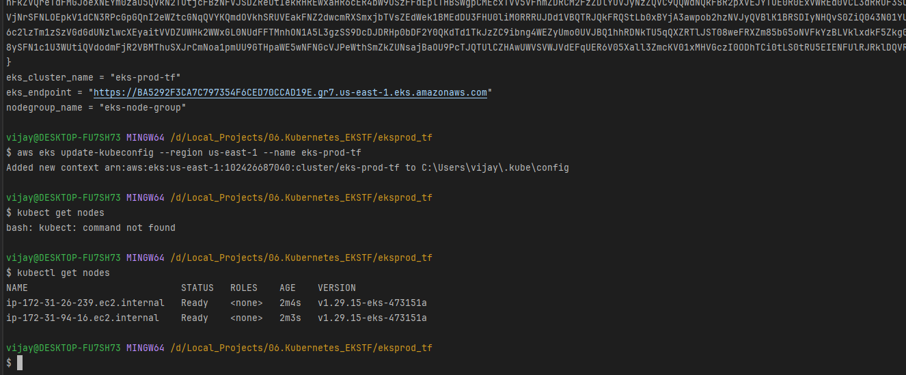
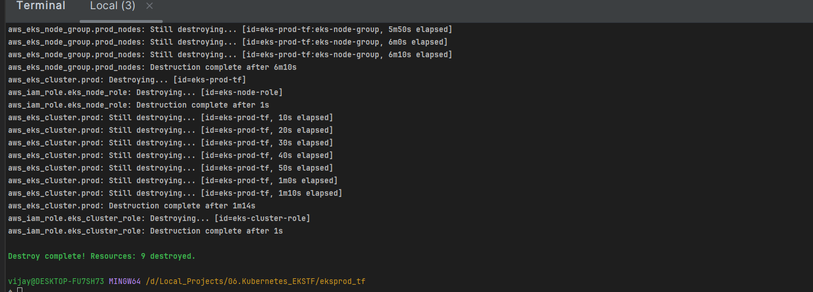

# 🚀 AWS - EKS Cluster by Terraform

This repository provisions an Amazon EKS cluster using Terraform with minimal required components — optimized for simplicity, readability, and modular growth. It includes:
- EKS cluster & node group
- IAM roles for control plane and workers
- S3 backend support for Terraform state

### 📁 Folder Structure

eks-cluster/
─ backend.tf 					# Remote state backend configuration (S3 + DynamoDB) 
─ main.tf						 # Provider setup and module orchestration 
─ versions.tf 					# Required Terraform and provider constraints
─ variables.tf 					# Input variables for region, cluster name, subnets, etc. 
─ outputs.tf					 # Useful outputs like kubeconfig values
─ terraform.tfvars 				# Environment-specific values (subnet IDs, names, etc.) 
- iam.tf 						# IAM roles for cluster and node groups
─ eks.tf						 # Core EKS cluster + node group definitions                             

###  ⚙️ Prerequisites
- Terraform >= 1.4.0
- AWS CLI installed and configured
- Existing S3 bucket and DynamoDB table for remote state
- Valid subnet IDs in at least 2 Availability Zones (see terraform.tfvars)

### 🏁 Launch EKS Cluster
- terraform init        # Initialize with backend

- terraform plan        # Preview the changes

- terraform apply       # Create the cluster and node group

### 📤 Access Cluster

Use the following to configure your kubeconfig:

      aws eks update-kubeconfig --region <aws_region> --name <cluster_name>                

      
      kubectl get nodes

### 🔥 Destroy All Resources

    terraform destroy

