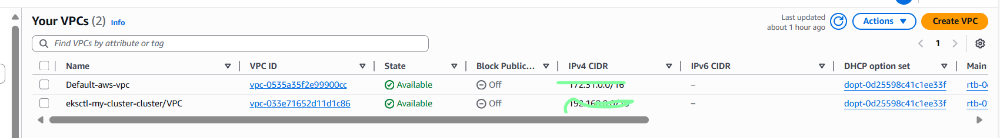
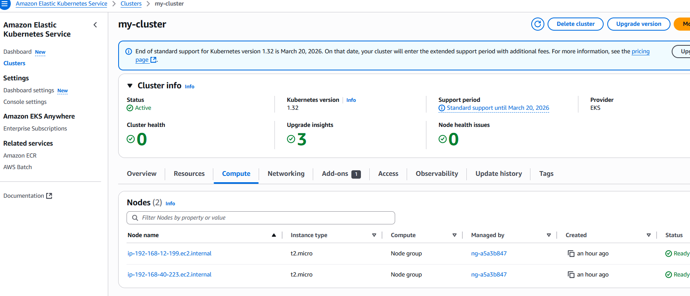

#  🚀 Launching EKS with eksctl: CLI method - Simplest

📦 1. Install Prerequisites
- Install kubectl - https://kubernetes.io/docs/tasks/tools/install-kubectl-windows/
  
      curl.exe -LO https://dl.k8s.io/release/v1.33.0/bin/windows/amd64/kubectl.exe
  
- Install eksctl and add it to your system PATH - https://eksctl.io/installation/

💻 2. Create Cluster (Command Line Equivalent)

      eksctl create cluster \
        --name my-cluster \
        --region us-east-1 \
        --version 1.32 \
        --nodegroup-name ng-managed \
        --node-type t2.micro \
        --nodes 2 \
        --managed

  
✅ 3. Validate

✅ 4. Delete Cluster

  
   eksctl delete cluster --name my-cluster --region us-east-1
   
