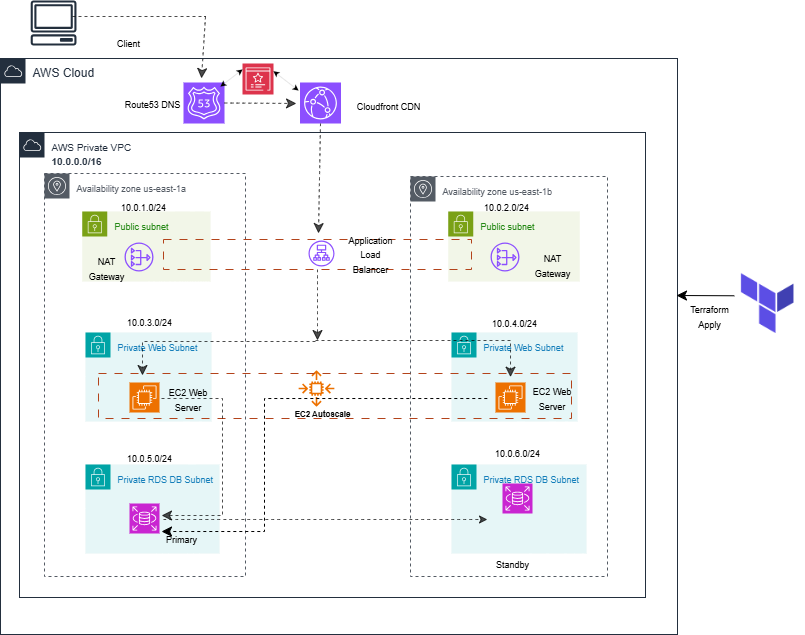
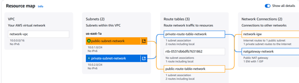
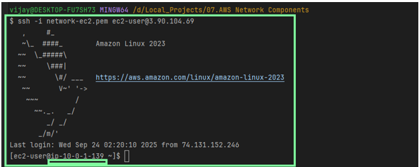
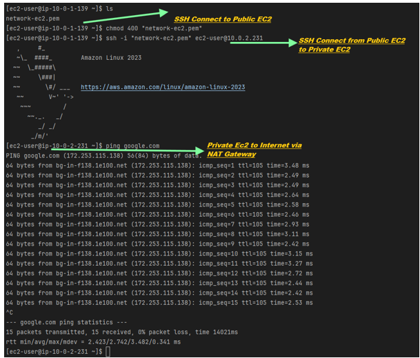

# 📐 AWS VPC Architecture – Networking & Connectivity 
####         VPC -  Subnets - Route Table - Internet Gateway -  NAT Gateway -  Security Groups **with default NACLs**

## 🖼️ Architecture Diagram

## 🧱 Networking Components Setup 
_Note: This can achived by Terraform(IaC) or AWS Console as well.

1. VPC
   - Create network-vpc with CIDR block 10.0.0.0/16
     Note: Consider the default NACL's as they get created with default all Allow In and Out bound.
2. Subnets
   - Public Subnet: public-subnet-network → 10.0.1.0/24
   - Private Subnet: private-subnet-network → 10.0.2.0/24
3. Internet Gateway
   - Create network-igw
   - Attach to network-vpc
   - Associate with public-subnet-network
4. NAT Gateway
   - Allocate Elastic IP
   - Create NAT Gateway in public-subnet-network
   - Associate Elastic IP
5. Route Tables
   - Public Route Table
      - Associate with public-subnet-network
      - Route: 0.0.0.0/0 → Internet Gateway
   - Private Route Table
      - Associate with private-subnet-network
      - Route: 0.0.0.0/0 → NAT Gateway
6. Security Groups
   - Inbound: Allow SSH (port 22), ICMP (ping), HTTP/HTTPS
   - Outbound: Allow all traffic
   - Attach to EC2 instances
7. EC2 Instances
   - Launch EC2 in public subnet (with/without key pair)
   - Launch EC2 in private subnet (with/without key pair)
   - Attach appropriate security group

## ✅ Connectivity Validation Steps
### 1. VPC Network
   - Subnet - Route Table - Intenet Gateway  - NAT gateway mapping

# 
     
### 2. SSH into Public EC2
   - Confirm EC2 private IP is within 10.0.1.0/24

   
### 3. Connect to Private EC2 
   - From Public EC2, SSH into Private EC2 using its private IP
   
### 4. Validate NAT Gateway
   - On Private EC2, connect the internet

     

##  🏁 Conclusion

Validates a complete AWS VPC setup with public and private subnets, secure EC2 access, and NAT-enabled outbound connectivity

   

