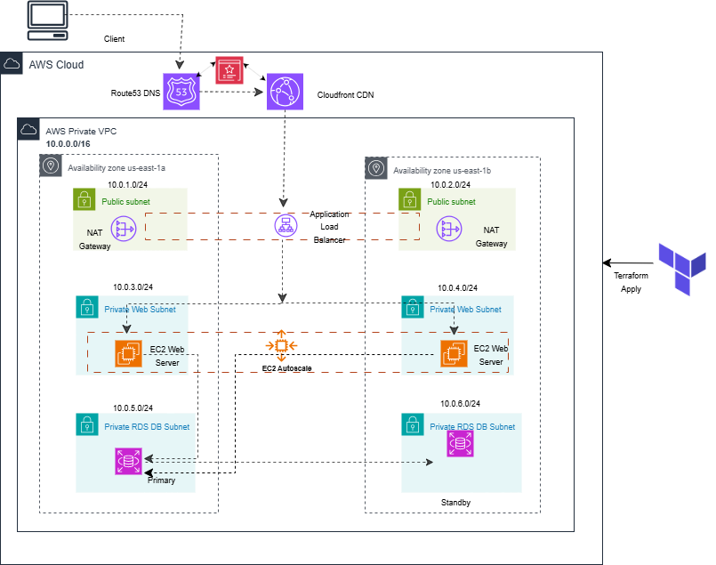
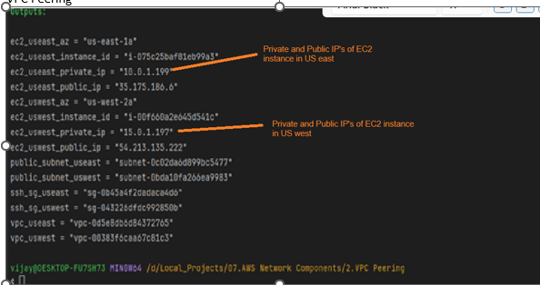

# 🌐 VPC Peering Test Across US East and West – Terraform + AWS Console

## 🧱 Infrastructure Overview
 - Two VPCs in US East and West Regions
 - Two EC2 instances: One in each VPC, Amazon Linux 2
 - VPC Peering: Created manually via AWS Console
 - Connectivity Test: Ping from  EC2 to from one region to other region

## 🖼️ Design

## 🚀 Create Infrastructure using a Terraform

• 	Create the VPC, EC2, Subnets, Route table configuration using a Terraform code. 

Create a VPC peering from console by providing a details as below. 

  
