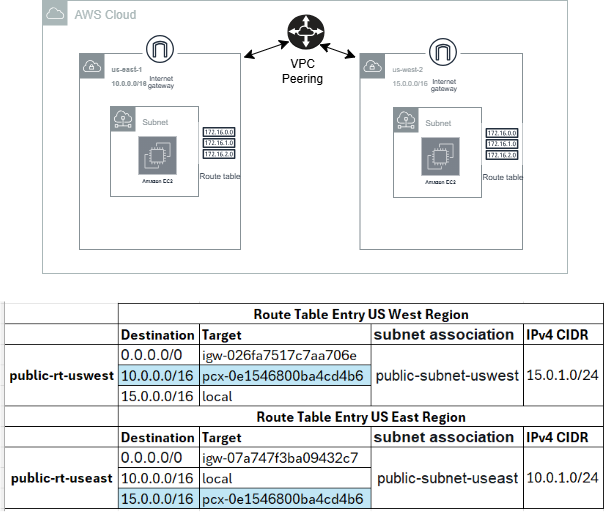
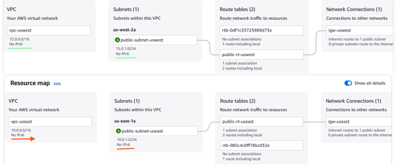
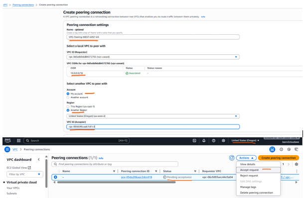
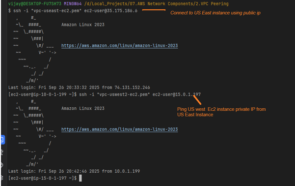

# 🌐 VPC Peering Test Across two AWS Regions 

(Note: Used Terraform for basic components + AWS Console for VPC Peering which can be achived for VPC's within a regions, across regions, accounts etc)

## 🧱 Infrastructure Overview
 - Two VPCs in US East and West Regions     
 - Two EC2 instances: One in each VPC, Amazon Linux 2
 - VPC Peering: Created manually via AWS Console
 - Connectivity Test: Ping from  EC2 to from one region to other region
Note: Consider the default NACL's as they get created with all Allow In and Out bound.

## Design

## 🚀 Create Infrastructure using a Terraform

- 	Create the VPC, EC2, Subnets, Route table configuration using a Terraform code. 

- VPC Network in both regions
  
  

- Create a VPC peering from console by providing a details as below.

## ✅ Connectivity Validation

### 1. SSH EC2 instance from one region to other using Private IP
   - VPC Subnet - Route Table - Intenet Gateway  - NAT gateway mapping

# 
     

##  🏁 Conclusion

Validates a complete AWS VPC peering between regions by accessing the EC2 instances by their private IP from to check the connetion with necessary VPC peering followed by Route table update.

  
