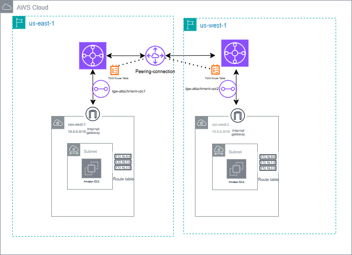

# 🌐 AWS Transit Gateway Peering Across Regions (CORS)

## 🚀 Use Case
- ✅ Connect multiple VPCs with different CIDR blocks
- ✅ Enable private IP communication between EC2 instances across VPCs
- ✅ Test Transit Gateway Attachments and route table updates VPC anf TGW routes
- ✅ Validate connectivity using ping/SSH between instances

## 🧱 Architecture
  - Region: us-east-1/us-west-2
  - Transit Gateway: In both region
  - VPCs:
    - VPC1: 10.0.0.0/16
    - VPC2: 15.1.0.0/16
  - EC2 Instances: One per VPC
  - Routing: TGW route propagation and manual route table updates
  - Security: SGs configured for SSH and ICMP (ping) - optional
    
   

## 🔗 Manual TGW Peering Setup
- Create Transit Gateway in each region via AWS Console.
- Attach VPCs to their respective TGWs.
- Create Peering Connection:
- Initiate from US East TGW (requestor)
- Accept from US West TGW (acceptor)
- Verify Peering Status: Ensure all attachments and peering connections show available.

## 📍 Route Table Configuration
-VPC Route Tables
	- Add route to remote VPC CIDR via TGW attachment in each region.
-TGW Route Tables
	- Add route to remote VPC CIDR via peering attachment.
	
Note:
- Propagation is enabled for peering attachments.
- Association is set correctly for VPC attachments.

	Repeat for both regions to enable bidirectional traffic flow.

## 🧪 Connectivity Validation
- SSH into EC2 instance using its public IP.
- Copy the private key to the instance.

## ✅ Key Takeaways
- TGW Peering enables cross-region VPC communication, but requires precise route table and attachment configuration.
- Security Groups must allow ICMP and SSH from the remote VPC CIDR — SG references across regions do not work.
- Default NACLs allow all traffic, but custom NACLs must explicitly permit ICMP and TCP.

