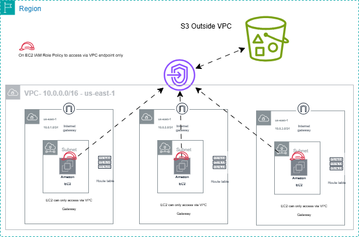
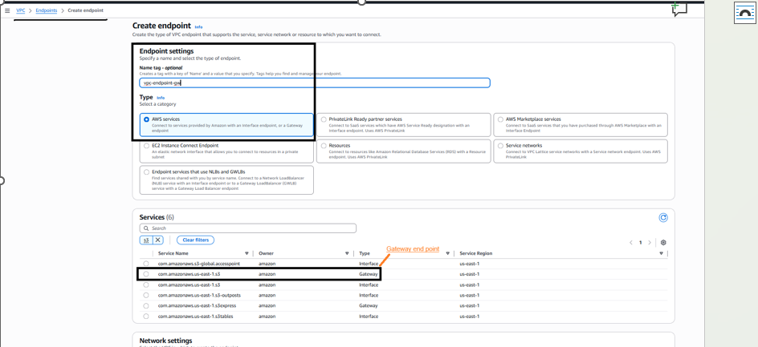
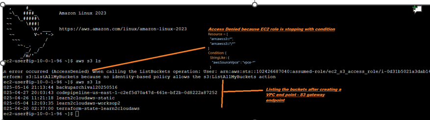

# ✅ VPC Endpoint–Restricted S3 Access (Terraform Validation)
This setup demonstrates how to enforce S3 access only via a VPC Gateway Endpoint, regardless of whether the EC2 instance is in a public subnet or has internet access.
# 🔧 Architecture Summary
   - EC2 instance launched in a public subnet with Internet Gateway
   - IAM role attached with S3 access policy scoped to aws:SourceVpce
   - VPC Gateway Endpoint created for S3
     
   - No NAT Gateway required
     
   

#  📦 Step-by-Step: Add VPC Gateway Endpoint for S3
   - vpc_id: Your VPC ID
   - route_table_ids: Route tables associated with subnets (public or private) that need S3 access
     
   - This creates a gateway endpoint, not an interface endpoint

# 📜 IAM Policy (S3 Access via VPC Endpoint Only)
	{
		"Version": "2012-10-17",
		"Statement": [{
			"Effect": "Allow",
			"Action": [
				"s3:GetObject",
				"s3:PutObject",
				"s3:ListBucket",
				"s3:ListAllMyBuckets"
			],
			"Resource": [
				"arn:aws:s3:::*",
				"arn:aws:s3:::*/*"
			],
			"Condition": {
				"StringEquals": {
				"aws:SourceVpce": "vpce-*"
          }
        }
       }]
     }

# 🧪 Validation Steps
   - Launch EC2 instance in a public subnet with a public IP.
   - Attach IAM role with the above policy.
    - Run:
       aws s3 ls 
     
	 - ✅ If traffic flows through the VPC endpoint, access is granted.
     - ❌ If traffic flows through the Internet Gateway, access is denied due to the aws:SourceVpce condition.
     
 
# 🔐 Key Takeaways for Security Enforcement
   - IAM policy ensures S3 access is only allowed via VPC endpoint, regardless of subnet type or public IP.
   - Prevents data exfiltration via public internet.
   - Ideal for hybrid subnet architectures with mixed access patterns.

