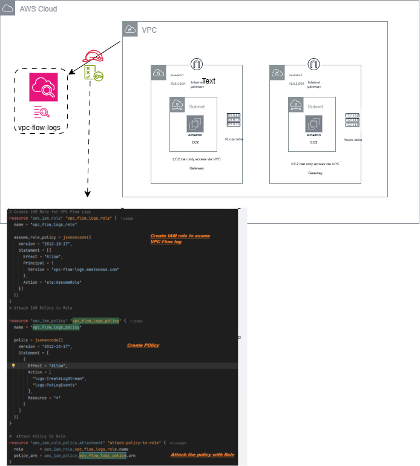
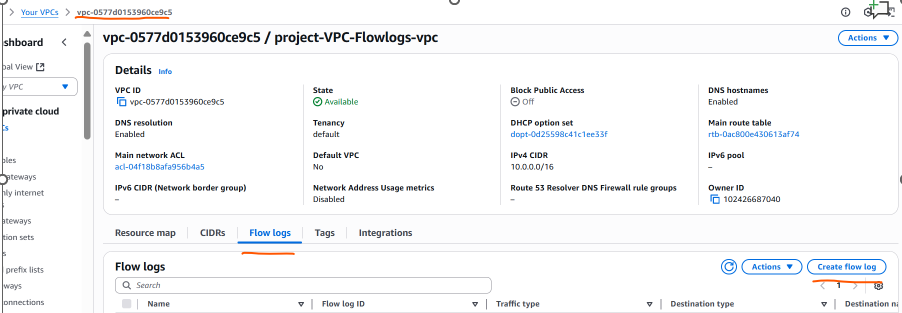
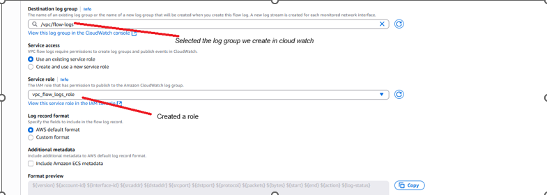

# 📘 VPC Flow Logs Demo – Terraform Setup
This demo provisions EC2 instances inside a custom VPC and enables VPC Flow Logs to stream network traffic data to Amazon CloudWatch Logs using IAM roles and policies.

# 🧱 Architecture / Design

### 🔹 Components
   - Custom VPC with public and private subnets
   - Internet Gateway and route tables
   - EC2 instances in public subnets
   - Security Groups for SSH/HTTP access
   - CloudWatch Log Group for storing flow logs
   - IAM Role + Inline Policy for log delivery
   - VPC Flow Logs capturing ALL traffic
     

	
# 🛠️ Step-by-Step Implementation on VPC Flow Logs

   - Confogure the VPC Flow Logs manually for validation

   - Select the Flow log and IAM role create by Terraform
   
# ✅ Validation Steps
   - Connect EC2 instance and try to ping your known IP or any common website
   - Validate the results in cloud watch logs

