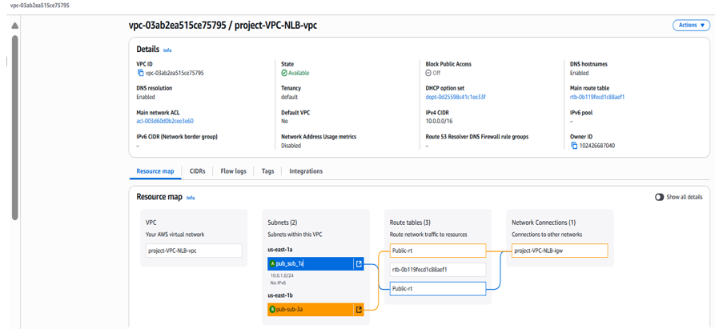
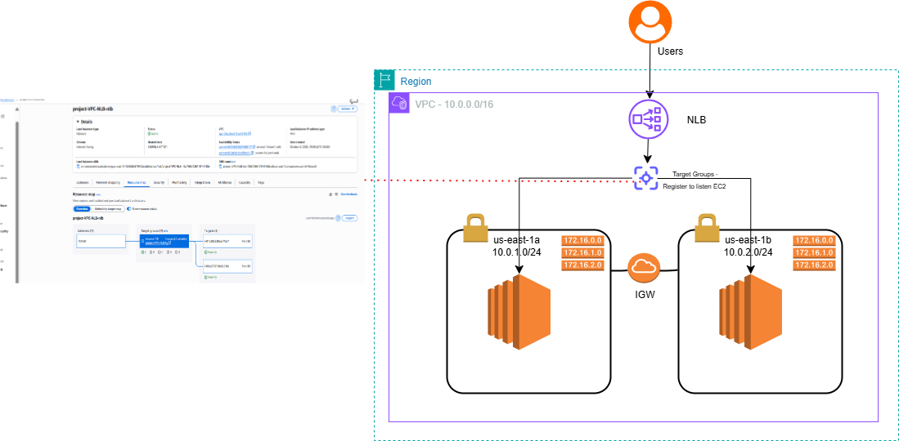
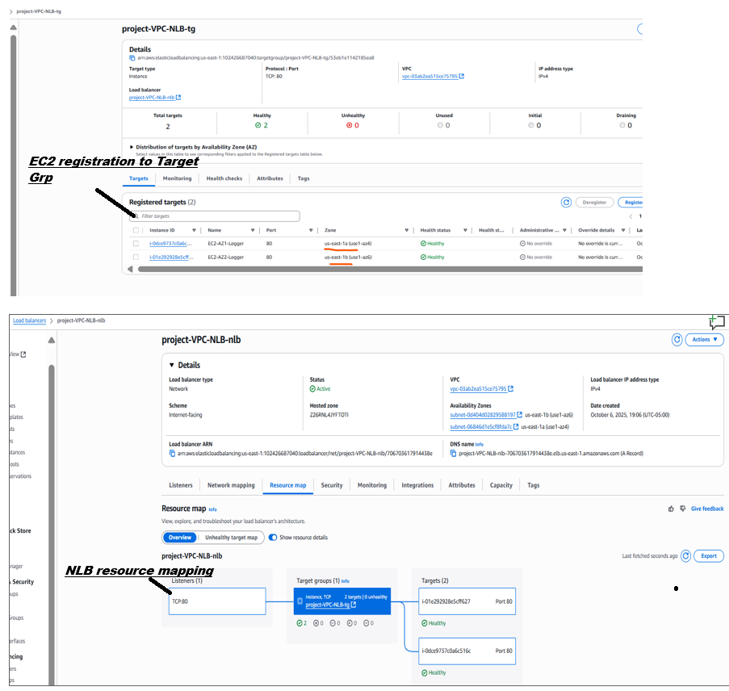
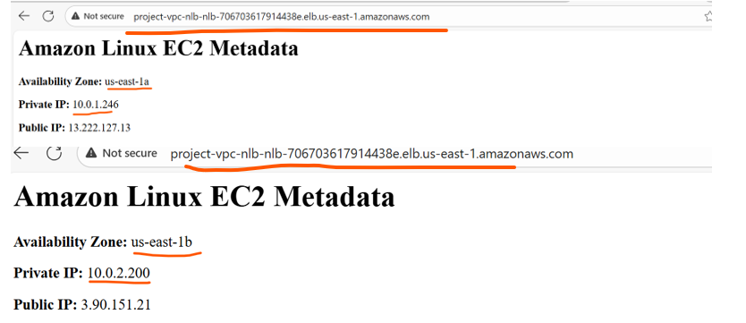

# 📘 VPC Flow Logs Demo – Terraform Setup
This demo provisions two EC2 instances inside a custom VPC - 2 subnets and enable to connect EC2 instance to be reached by Network Load Balancer

# 🧱 Architecture / Design

### 🔹 Components
   - Custom VPC with public and private subnets
   - Internet Gateway and route tables
   - EC2 instances in public subnets
   - Security Groups for SSH/HTTP access
   - Create a target groups and assosiate the available EC2 instances at listenr port 80.

     

	
# 🛠️ Step-by-Step Implementation on VPC Flow Logs

   - Confogure the VPC Flow Logs manually for validation

      
# ✅ Validation Steps
   - Connect EC2 instances via DSN name of NLB - which will point to instances in both AZ's instances. 
   

# 🔑 Key Takeaways

