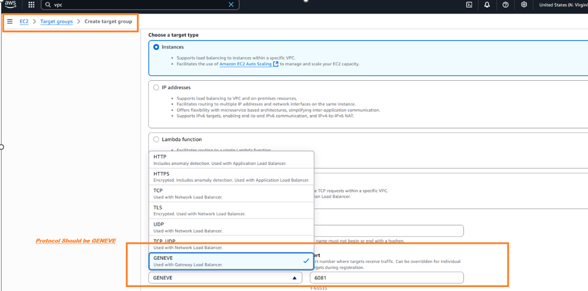
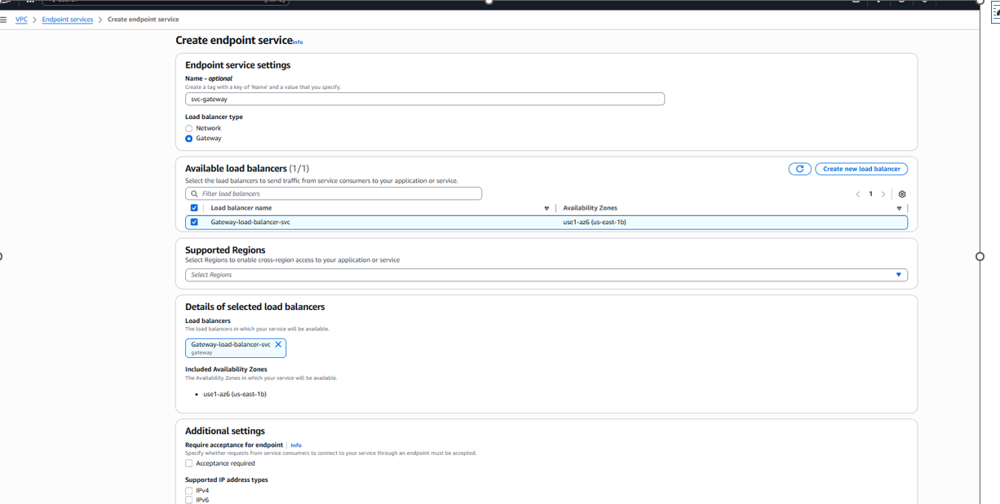

# 🚀 Gateway Load Balancer
 ## Overview:
 Gateway Load Balancer (GWLB) architecture using Terraform, showcasing traffic inspection between two VPCs via GENEVE encapsulation.
 Ideal for security appliances, deep packet inspection, or service chaining scenarios.

 ## 🧩 Architecture Overview
 
 
 
 # 🔧 Key Components
- VPCs & Subnets: Isolated Client and Appliance VPCs with public subnets.
- Security Groups: Fine-grained rules for SSH, ICMP, and GENEVE (UDP 6081).
- EC2 Instances:
- client-ec2: test initiator.
- Gateway Load Balancer:
- GENEVE listener forwarding to appliance EC2.

- Target group with health checks on port 22.
- Endpoint Service: Enables GWLB endpoint creation in peer VPC.

- Routing Tables: Bidirectional flow via GWLB endpoint.

# 🧪 Validation Steps
- SSH into client EC2:
ssh ec2-user@<client_public_ip>
- Ping appliance EC2:
ping 81.0.1.X
- Trigger inspection:
curl http://81.0.1.X
- Check logs on appliance EC2:
sudo grep INSPECTED_TRAFFIC /var/log/messages

📘 Notes
- Appliance EC2 enables IP forwarding and logs inspected traffic.
- GWLB endpoint in client VPC ensures traffic redirection to appliance.
- Return traffic routing via GWLB endpoint in appliance VPC is optional and commented.

