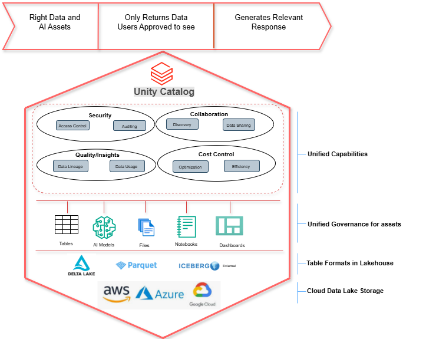

#  How Unity Catalog Matters ?

In the modern Data and AI landscape, maintaining a **single source of truth and enforcing consistent governanc**e has become one of the biggest challenges for enterprises.
Data lives everywhere — in cloud storage, BI dashboards, MLflow models, notebooks, and across multiple file and table formats. Managing access, lineage, quality, and compliance across all these systems often leads to:

- Increased **risk**
- Slower innovation
- **Poor business decision-making**
- **Higher operational costs**

**Unity Catalog exists to solve exactly this problem.**

## 🔷 What Is Unity Catalog?

Unity Catalog is the unified governance and control plane for the Databricks Lakehouse.
It centralizes security, discovery, lineage, quality, and cost optimization across all data and AI assets, including:

- Tables
- Files
- AI Models
- Notebooks
- Dashboards

And it works **seamlessly across all major cloud platforms**:

- AWS S3
- Azure ADLS Gen2
- Google Cloud Storage

With support for **open table formats**:

- Delta Lake (native)
- Parquet
- Iceberg (external)

## 🧩 The Real Problem It Solves
Before Unity Catalog, enterprises struggled with:

❌ **Multiple governance models**

Each workspace had its own permissions, making consistency nearly impossible.

❌ **No unified lineage**

Teams couldn’t see how data flowed from ingestion → pipelines → dashboards.

❌ **No cross-cloud or cross-team sharing**

Sharing data meant copying it — increasing cost, risk, and duplication.

❌**No central audit trail**

Compliance teams lacked a single place to track who accessed what.

❌**Duplicate datasets everywhere**

Teams recreated their own “gold” tables, wasting compute and storage.

**Unity Catalog solves all of these by providing one governance layer for everything.**

It’s not just a feature — it’s the foundation that makes the modern lakehouse scalable, compliant, and enterprise‑ready.

# 🧩 Unity Catalog Pillars
Unity Catalog is built on four core pillars that address the most critical enterprise needs.

## 🔐 1. Security
Who can access what — and how it’s audited
- Fine‑grained access control (table, column, row)
- Attribute‑based access control (ABAC)
- Audit logs for every read/write
- Compliance support (HIPAA, PCI, SOX, GDPR)

So, Enterprise get consistent, centralized, least‑privilege access across all clouds and workspaces.
## 🤝 2. Collaboration
How teams find, understand, and share data
- Searchable catalogs and metadata
- Tags, classifications, business glossary
- Delta Sharing for cross-cloud, cross-organization sharing
- Domain-aligned catalogs for data mesh architectures

So, teams stop working in silos and start sharing trusted, governed data products.

## 📊 3. Quality / Insights
Where data comes from — and how it’s used
- End‑to‑end lineage (jobs, notebooks, dashboards)
- Column‑level lineage
- Usage analytics (popular tables, query history)
- Data quality metrics (via DLT / LakeFlow)

So, Organizations gain trust in their data and can optimize pipelines with confidence.

## 💰 4. Cost Control
How to avoid waste and optimize pipelines
- Least‑privilege access reduces unnecessary scans
- Lineage reveals redundant pipelines and duplicate tables
- Delta Lake optimizations reduce compute and storage
- Prevents shadow copies across teams

So, Governance becomes a cost‑saving engine, not just a security tool.

## 🗂️ What Unity Catalog Governs

Unity Catalog governs all **major asset types in the lakehous**e:

      Tables   •   AI Models   •   Files   •   Notebooks   •   Dashboards

So, this is what makes it truly unified.

## 🌐 Cloud Storage + Table Formats
Unity Catalog works across all **major cloud data lake**s:

- AWS S3
- Azure ADLS Gen2
- Google Cloud Storage
  
And supports **open table formats**:

- **Delta Lake (native)**
-** Parquet**
- Iceberg (external)

**This allows enterprises to adopt open, multi‑cloud architectures without losing governance.**

## 🎯 Takeaway

Unity Catalog is the foundation that enables scalable, compliant, and high‑quality data and AI across the enterprise — faster, safer, and with complete governance.

