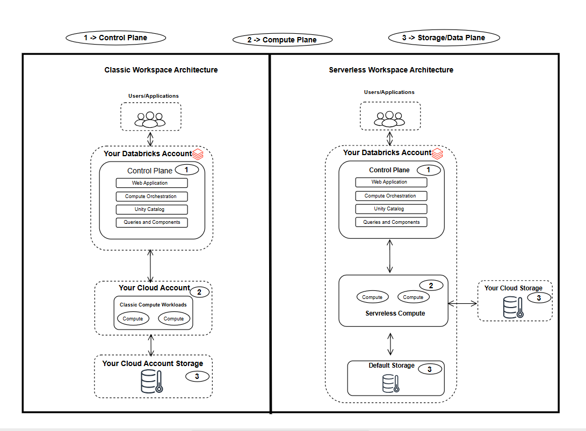

# 📘 Databricks Platform Objects & Workspace Architecture

## 🏛️ Databricks Account‑Level Objects
Databricks accounts contain several foundational platform objects that govern identity, workspaces, compute, and governance.

## Databricks Objects Architecture

## 🔐 Identity & Access

- Manage users, groups, and service principals
- Configure SCIM provisioning and SSO/SAML
- Centralized identity lifecycle management
	
## 🧭 Workspace Management

- Create, update, and delete Databricks workspaces
- Configure workspace‑level compute, storage, and networking
- Manage workspace‑specific settings and integrations
	
## 📚 Unity Catalog Metastore Management

- Create and attach metastores to workspaces
- Govern schemas, tables, views, volumes, and ML models
- Enforce centralized data governance and access control
   
## 💳 Usage & Billing

- Account‑level usage tracking
- Billing, compliance, and policy enforcement
   
## 🧪 Workspace

A collaborative environment where users:
- Run compute workloads
- Develop notebooks, SQL queries, and ML pipelines
- Schedule jobs and tasks
- Access all Databricks platform services
	
## 🗂️ Unity Catalog Metastores

Unity Catalog provides centralized governance for all data and AI assets:
- Schemas
- Tables & Views
- Volumes
- ML Models
- Permissions & lineage

It ensures consistent governance across all workspaces attached to the same metastore.

# 🏗️ Databricks Workspace Architecture

A Databricks workspace operates across three major architectural layers.

## Databricks Workspace Architecture

## 🧠 Control Plane

Hosted by Databricks includes:
- Web UI & APIs
- Unity Catalog
- Compute orchestration
- Platform services
- Query execution & code management

Acts as the central coordination layer for all workspace operations.

## ⚙️ Compute Plane
Where actual data processing happens.

Two compute models exist:

1. Serverless Compute
- Fully managed by Databricks
- Runs inside the Databricks account
- No customer‑managed infrastructure required

2. Classic Compute
Runs inside your cloud account:
- AWS: EC2
- Azure: VM
- GCP: GKE

Gives customers full control over networking, VPCs, and security boundaries.

## 🗄️ Data Layer
Where your actual data lives, depending on cloud provider:

Cloud and Storage
- AWS	with    S3
- Azure with  ADLS Gen2
- GCP	with Google Cloud Storage

Data is stored in your cloud account and accessed by Databricks compute.