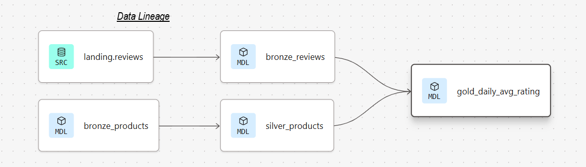
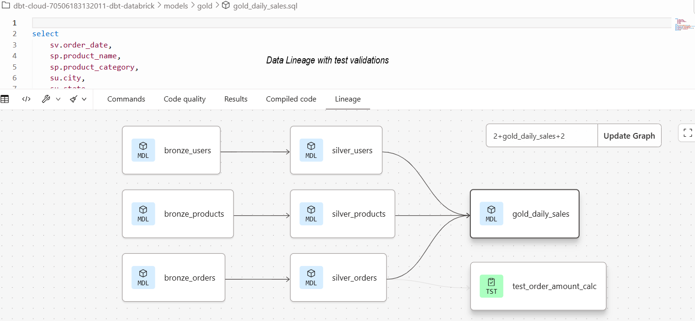
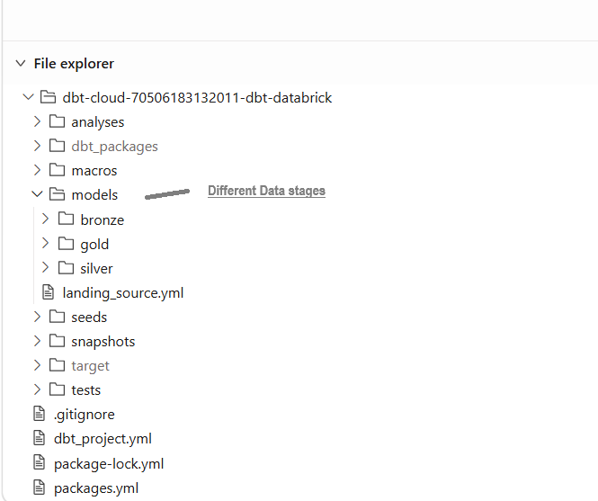
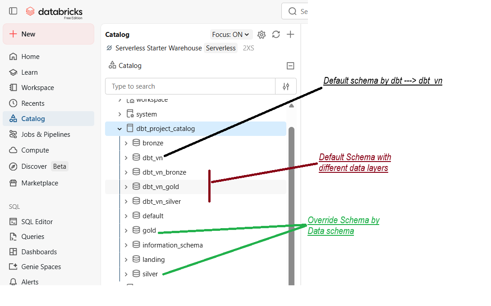

# 📌 Overview

This project demonstrates a practical implementation of modern data transformation workflows using dbt 
on Databricks, following the Medallion Architecture.

It focuses on building clean, modular, testable, and scalable analytics pipelines aligned with analytics 
engineering best practices

## 1️⃣ Objective

The goal of this project is to learn and implement:

1> Medallion Architecture (Bronze, Silver, Gold)

2> dbt model organization and modular development

3> Data testing and validation

	Dependency management using ref()

	Source definitions using source()

	Incremental transformations for scalable pipelines

	Snapshot concepts for historical tracking

	End-to-end workflow execution using dbt build

This project simulates a real‑world analytics engineering workflow using structured raw datasets.

## 2️⃣ Data Pipeline / Architecture

  Source Data
       ↓
Bronze / Landing Layer
       ↓
Silver / Cleansed Layer
       ↓
Gold / Business Layer

Bronze Layer

	Raw ingested source tables

	Minimal transformations

	Preserves original structure

Silver Layer

	Cleaned and standardized datasets

	Deduplication and normalization

	Renamed columns and applied business rules

Gold Layer

	Aggregated, business‑ready models

	Reporting and analytics datasets

	Fact and dimension‑style outputs

## 🔄 dbt Workflow

Sources → Staging → Transformations → Tests → Gold Models

The workflow includes:

	Source ingestion using source()

	Staging and transformation models using ref()

	Data quality checks (schema + business rules)

	Snapshot execution for historical tracking

	Seed loading for reference datasets

	Lineage tracking through the dbt DAG
	
	

	
	
	
## 🗂️ Project Structure / Folder Structure

  
  
## 📁 Folder Structure Explanation

models/

Contains all SQL transformation models, organized by Medallion layers:

	bronze/ – raw ingestion

	silver/ – cleaned and conformed

	gold/ – business‑ready analytics

macros/

Reusable Jinja macros to:

	Reduce repeated SQL logic

	Improve maintainability

	Standardize transformation patterns

tests/

Custom data quality tests:

	not_null

	unique

	Source validation tests

	Ensures reliability and trust in downstream datasets.

snapshots/

Used for historical data tracking:

	Tracks changing records over time

	Implements Slowly Changing Dimension (SCD) concepts

seeds/

Static CSV reference datasets:

	Lookup tables

	Controlled small datasets

dbt_packages/

Installed dbt dependencies such as:

	dbt_utils  

macros/

Provides community macros and utilities.

target/

Generated artifacts from dbt execution:

	Compiled SQL

	Manifest files

	Run logs

analyses/

Ad-hoc SQL analysis files:

	Exploratory queries

	Validation checks

	Experimentation

# 📸 Proof of Execution

	
## 🧠 Key Learnings & Insights

# This project demonstrates practical usage of:

ref() for model dependencies

source() for source definitions

dbt models (table, view, incremental)

Data tests (schema + custom)

Snapshots for historical tracking

Incremental models for scalable pipelines

Materializations (table, view, incremental)

Jinja templating for reusable logic

Lineage tracking through the dbt DAG
	
# Commands Used:
	
dbt debug

dbt compile

dbt run

dbt deps

dbt snapshot

dbt test

dbt build

dbt build --full-refresh

dbt test --select model_names..and more

