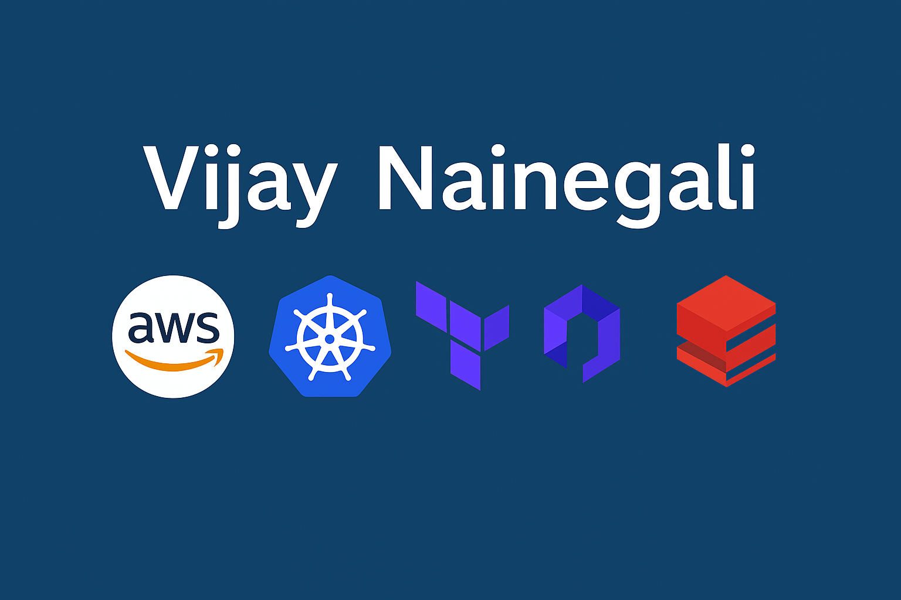

# 🚀 Vijay - Cloud Portfolio 
   

Welcome to my curated portfolio of AWS infrastructure projects, built to demonstrate hands-on expertise in cloud architecture, DevOps automation, and data platform integration.

Each demo reflects production-grade patterns with Terraform, CI/CD pipelines, Kubernetes orchestration, secure networking designed to be modular, Databricks, Datalake, medalian pipeline and production ready patterns.

## 🌟 Highlights
- ✅ Scalable AWS architectures with Infrastructure as Code (Terraform, CloudFormation)
- 🔁 Automated CI/CD pipelines for EC2, Lambda, and container workloads
- 🐳 Kubernetes/EKS clusters deployed via eksctl, EC2 CLI, and Terraform
- 🧠 Enterprise networking demos: VPC peering, endpoints, flow logs, Transit Gateway
- 📊 Data platform integrations with Databricks Platform, Unity Catalog, Data pipelines
- 🔒 Security‑first design: IAM roles, encryption, private networking, monitoring

---

## 🗂️ Full Project & Demo Index

| 📦 **Project / Demo** | 📘 **Description** | 🔗 **Link** |
|------------------------|--------------------|-------------|
| **Static Website Hosting** | Host a static website using S3, CloudFront, and Route 53 | [Link](./01.Static%20Website) |
| **Three-Tier Application Deployment** | Deploy a 3-tier app (Web, App, DB) using Terraform modules | [Link](./02.Three%20tier%20application%20with%20Terraform) |
| **CI/CD Pipeline for EC2** | Automate EC2 deployment using CodePipeline and CodeDeploy | [Link](./03.AWS%20CICD%20for%20EC2%20Deployment) |
| **CI/CD Pipeline for Lambda** | Automate Lambda deployment using CodePipeline and SAM | [Link](./04.AWS%20CICD%20for%20Lambda%20Deployment) |
| **EKS Cluster – eksctl Method** | Quick CLI-based cluster creation using eksctl | [Link](./05.AWS%20EKS%20Cluster%20Launch%20Options/1.K8cluster_AWSEKS_eksctl_simple) |
| **EKS Cluster – EC2 + Console Method** | Manual setup via AWS Console and EC2 CLI | [Link](./05.AWS%20EKS%20Cluster%20Launch%20Options/2.K8cluster_AWSEC2_console) |
| **EKS Cluster – Terraform Method** | Infrastructure as Code for scalable EKS | [Link](./05.AWS%20EKS%20Cluster%20Launch%20Options/3.K8cluster_AWSEKS_terraform) |
| **VPC and Core Networking Setup** | VPC, subnets, route tables, IGW | [Link](./06.AWS%20Networking%20Components/1.VPC%20and%20Core%20Components) |
| **VPC Peering** | Connect two VPCs for private routing | [Link](./06.AWS%20Networking%20Components/2.VPC%20Peering) |
| **Transit Gateway – One Region** | Centralized routing across VPCs in one region | [Link](./06.AWS%20Networking%20Components/3.Transit%20Gateway%20-%20Multi%20VPC%20-%20One%20Region) |
| **Transit Gateway – Cross Region** | Connect VPCs across regions | [Link](./06.AWS%20Networking%20Components/4.Transit%20Gateway%20-%20Cross%20Region) |
| **VPC Endpoint** | Private access to AWS services via endpoints | [Link](./06.AWS%20Networking%20Components/5.VPC%20Enpoint) |
| **VPC Flowlogs** | Monitor and log VPC traffic | [Link](./06.AWS%20Networking%20Components/6.VPC%20Flowlogs) |
| **Network Load Balancer (NLB)** | High-performance TCP load balancing | [Link](./06.AWS%20Networking%20Components/7.Network%20Load%20Balancer) |
| **Gateway Load Balancer (GLB)** | Traffic inspection via GENEVE encapsulation | [Link](./06.AWS%20Networking%20Components/8.Gateway%20Load%20Balancer) |
| **Databricks - Unity Catalog (Why and How ?)** | Central Governance Capabilities in Datalake | [Link](./07.Databricks%20Unity%20Catalog%20Governance) |  
| **Databricks - Fivetran Ingestion** | Datalake - Medallion Data flow | [Link](./08.Databricks%20Datapipeline%20with%20FiveTran) |

## 🌐 Connect with Me

- [LinkedIn Profile](https://www.linkedin.com/in/vijay-nainegali/)

## 🏅 Certifications 

### Credly Publlic Profile -> https://www.credly.com/users/vijay-nainegali/badges#credly                         and   https://www.credential.net/profile/vijaynainegali912106/wallet 

| Certification | Badge | Link |
|---------------|-------|------|
|**AWS Certified Solutions Architect – Professional**| |[Architect Professional](https://www.credly.com/badges/5bb819bc-ae9f-4546-b472-064949b49a4c/public_url)
|**AWS Certified DevOps Engineer – Professional**||[DevOps Professional](https://www.credly.com/badges/07282de3-19b9-496e-acc7-25a31a01665e/public_url)
|**Databricks Certified Data Engineer Associate**||[Databricks Certified Data Engineer Associate](https://credentials.databricks.com/4f436e28-5bbd-450d-b930-6757daee00d2)
|**Databricks Platform Administrator**||[Databricks Platform Administrator](https://credentials.databricks.com/4ce67de1-8135-415e-8406-8c03c694cb11)
|**AWS Databricks Platform Architect**||[AWS Databricks Platform Architect](https://credentials.databricks.com/ea979343-030d-4481-b670-9a296700d9bc?record_view=true)
|**HashiCorp Certified: Terraform Associate (003)**||[Terraform Associate](https://www.credly.com/badges/e5da1168-fc4c-472d-bab7-d8c46d125e79/public_url)
|**Databricks Fundamentals**||[Databricks Fundamentals](https://credentials.databricks.com/91b4dfc1-a579-4901-9aa5-cb00173894e3#acc.kChnGR78)
|**Kubernetes Certified Application Developer (CKAD)**| Udemy |[CKAD](https://www.udemy.com/certificate/UC-919f5657-7d7f-46d1-9282-fd414efb70ca/)
|**AWS Certified Architect – Associate**||[Architect – Associate](https://www.credly.com/badges/28bfdb72-4758-4606-a3a2-7e714ec878da/public_url)
|**AWS Certified Developer – Associate**||[Developer – Associate](https://www.credly.com/badges/bad31d88-dfb7-4af5-b35b-6b686e7366ea/public_url)
|**AWS Certified Cloud Practitioner**||[AWS Practitioner](https://www.credly.com/badges/2ca794d0-67ae-4ba4-bbce-eb0ba8f64eb5/public_url)

